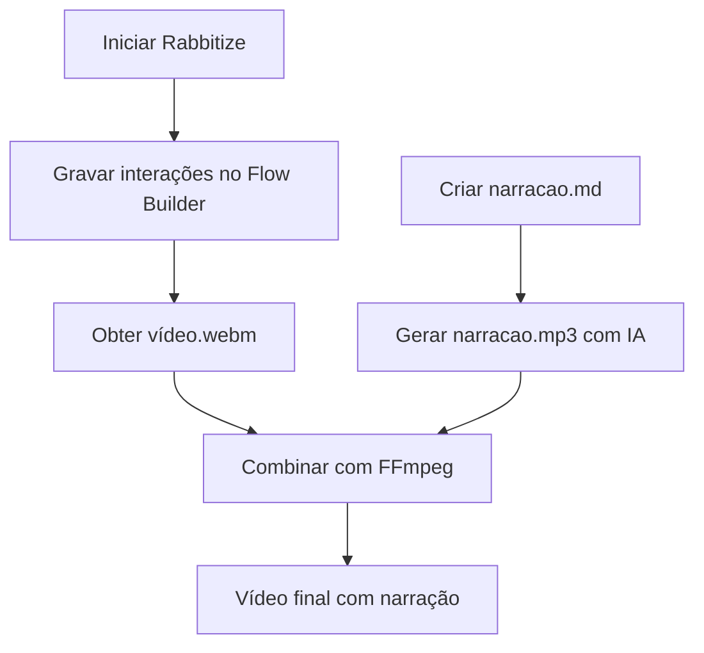

# 📹 Guia Completo: Criando Vídeo de Demonstração com Rabbitize

Este guia ensina como utilizar o **Rabbitize** para criar um vídeo de demonstração da sua aplicação, capturando interações com a landing page e o Streamlit, além de integrar narração em áudio gerada por IA.

---

## 📌 Pré-requisitos

- Node.js (versão 16 ou superior)
- NPM ou Yarn
- Navegador Chromium (instalado automaticamente)
- Aplicação Streamlit em execução (`streamlit run app.py`)

---

## 🚀 Passo 1: Instalação do Rabbitize

```bash
# Instalar o Rabbitize globalmente
npm install -g rabbitize

# Instalar dependências do Playwright
sudo npx playwright install-deps

# Instalar navegador Chromium
npx playwright install chromium

# Iniciar o servidor Rabbitize
npx rabbitize
```

Após a instalação, o servidor estará disponível em: `http://localhost:3037`

---

## 🎬 Passo 2: Criando a Gravação

### Método A: Usando o Flow Builder (Recomendado)

1. Acesse `http://localhost:3037/flow-builder` no navegador
2. Digite a URL da sua landing page no campo e clique em **Start**
   - Exemplo: `https://meusistema.com` ou `http://localhost:3000`
3. Execute sua demonstração:
   - Navegue até a página do Streamlit (ex: clicando em "Abrir App")
   - Clique nos botões, preencha formulários, execute as ações desejadas
   - Cada clique e interação é registrado automaticamente
4. Quando terminar, clique em **Stop Session**

O vídeo é salvo automaticamente em:

```
rabbitize-runs/[session-id]/video.webm
```

### Método B: Usando CLI (Para automação)

Crie um arquivo `comandos.json` com as ações:

```json
[
  [":move-mouse", ":to", 100, 200],
  [":click", ":at", 100, 200],
  [":type", "texto de exemplo"],
  [":wait", 3],
  [":move-mouse", ":to", 300, 400],
  [":click", ":at", 300, 400]
]
```

Execute o comando:

```bash
rabbitize --stability-detection false \
          --exit-on-end true \
          --process-video true \
          --client-id "demo-streamlit" \
          --port 3000 \
          --batch-url "https://sua-landing-page.com" \
          --batch-commands='[
            [":move-mouse", ":to", 100, 200],
            [":click", ":at", 100, 200],
            [":wait", 2],
            [":move-mouse", ":to", 300, 400],
            [":click", ":at", 300, 400]
          ]'
```

---

## 🗂️ Passo 3: Organizando o Conteúdo da Narração

Crie um arquivo `narracao.md` com o roteiro para a narração em áudio:

```markdown
# 🎙️ Roteiro de Narração - Demonstração do Sistema

## Cena 1: Página Inicial (0:00 - 0:05)
Bem-vindo ao nosso sistema de gerenciamento inteligente. Nesta demonstração, vamos mostrar como você pode utilizar nossas ferramentas de forma simples e eficiente.

## Cena 2: Acessando o Streamlit (0:05 - 0:15)
Agora vamos acessar nossa aplicação principal, desenvolvida com Streamlit. Clique no botão "Abrir Aplicação" para continuar.

## Cena 3: Interação com o Sistema (0:15 - 0:30)
Na tela principal, você encontra todas as funcionalidades. Vamos inserir alguns dados no formulário e clicar em "Processar" para ver o sistema em ação.

## Cena 4: Resultado (0:30 - 0:40)
Veja como os dados são processados e apresentados em tempo real. O sistema é rápido e intuitivo.

## Cena 5: Encerramento (0:40 - 0:50)
Esta foi uma demonstração rápida das funcionalidades principais. Para mais informações, consulte nossa documentação completa.
```

---

## 🔊 Passo 4: Gerando Áudio com IA

### Opção A: Usando Google Text-to-Speech (gTTS) — Python

Crie um script `gerar_audio.py`:

```python
from gtts import gTTS
import os

# Ler o roteiro
with open('narracao.md', 'r', encoding='utf-8') as file:
    lines = file.readlines()

# Extrair apenas as linhas de narração (sem os cabeçalhos)
texto_narracao = []
for line in lines:
    if line.startswith('##') or line.startswith('#'):
        continue
    if line.strip():
        texto_narracao.append(line.strip())

texto_completo = ' '.join(texto_narracao)

# Gerar áudio em português
tts = gTTS(text=texto_completo, lang='pt', slow=False)
tts.save('narracao.mp3')
print("✅ Áudio gerado com sucesso!")
```

Execute:

```bash
pip install gtts
python gerar_audio.py
```

### Opção B: Usando ElevenLabs API (Maior qualidade)

```bash
# Instalar CLI
npm install -g elevenlabs-cli

# Gerar áudio
echo "Seu texto de narração aqui..." | elevenlabs-cli \
  --api-key "sua_chave_aqui" \
  --voice-id "21m00Tcm4TlvDq8ikWAM" \
  --output narracao.mp3
```

### Opção C: Usando Edge TTS (Gratuito, qualidade boa)

```bash
# Instalar
pip install edge-tts

# Gerar áudio
edge-tts --text "Seu texto de narração aqui..." --write-media narracao.mp3 --voice pt-BR-AntonioNeural
```

---

## 🎞️ Passo 5: Combinando Vídeo e Áudio

Use o **FFmpeg** para unir o vídeo e o áudio:

```bash
# Instalar FFmpeg (se não tiver)
# Ubuntu/Debian: sudo apt install ffmpeg
# macOS:         brew install ffmpeg
# Windows:       baixar de ffmpeg.org

# Combinar vídeo do Rabbitize com áudio gerado
ffmpeg -i rabbitize-runs/demo-streamlit/video.webm \
       -i narracao.mp3 \
       -c:v libx264 \
       -c:a aac \
       -map 0:v:0 \
       -map 1:a:0 \
       -shortest \
       -movflags +faststart \
       apresentacao_final.mp4
```

> ✅ Vídeo final: `apresentacao_final.mp4`

### Ajuste fino do áudio (opcional)

Se o áudio estiver mais longo que o vídeo:

```bash
# Ajustar velocidade do áudio para caber no vídeo
ffmpeg -i narracao.mp3 -filter:a "atempo=1.2" narracao_ajustada.mp3

# Combinar novamente
ffmpeg -i rabbitize-runs/demo-streamlit/video.webm \
       -i narracao_ajustada.mp3 \
       -c:v libx264 -c:a aac -map 0:v:0 -map 1:a:0 -shortest \
       apresentacao_final.mp4
```

---

## 📋 Resumo do Fluxo Completo



---

## 🛠️ Comando Único para tudo (Linux/macOS)

Crie um script `demo.sh`:

```bash
#!/bin/bash

# Iniciar Rabbitize
npx rabbitize &
sleep 5

# Iniciar Streamlit
streamlit run app.py &
sleep 5

# Abrir landing page no navegador
open http://localhost:3037/flow-builder

echo "✅ Serviços iniciados!"
echo "📹 Grave sua demonstração no Flow Builder"
echo "⚡ Quando terminar, pressione ENTER para continuar"
read

# Gerar áudio
edge-tts --text "Bem-vindo à demonstração do nosso sistema..." --write-media narracao.mp3 --voice pt-BR-AntonioNeural

# Combinar vídeo e áudio
ffmpeg -i rabbitize-runs/latest/video.webm -i narracao.mp3 \
       -c:v libx264 -c:a aac -map 0:v:0 -map 1:a:0 -shortest \
       apresentacao_final.mp4

echo "🎬 Vídeo gerado: apresentacao_final.mp4"
```

---

## 📝 Dicas Finais

- **Streamlit:** Deixe sua aplicação rodando em `http://localhost:8501` durante a gravação
- **Landing Page:** Certifique-se de que o link para o Streamlit esteja funcionando
- **Qualidade do vídeo:** O Rabbitize captura em alta resolução; use `viewport: "1080p"` no roteiro

**Legendagem automática** com Whisper (OpenAI):

```bash
pip install openai-whisper
whisper narracao.mp3 --model small --language Portuguese --output_format srt
```

**Compactar** o vídeo final:

```bash
ffmpeg -i apresentacao_final.mp4 -vf scale=1280:720 -c:v libx264 -crf 23 apresentacao_compactada.mp4
```

---

## 🔗 Links Úteis

- [Rabbitize GitHub](https://github.com/rabbitize/rabbitize)
- [Playwright Screencast API](https://playwright.dev/docs/videos)
- [ElevenLabs](https://elevenlabs.io)
- [Edge TTS](https://github.com/rany2/edge-tts)

---

## 🏗️ Plano de Automação — JobMatch AI + Rabbitize

Estrutura geral:

```
pré-requisitos → validação → gravação → pós-produção → artefato final
```

### Plan A (Prioritário): Batch Automatizado via CLI

#### Pré-requisitos

| Passo | Comando | Função |
|---|---|---|
| A0 | `poetry install` | Dependências do projeto |
| A1 | `python train_pipeline.py` | Treina modelos, gera `metrics.json` |
| A2 | `pytest tests/ -x --tb=short` | Valida pipeline antes de gravar |

#### Gravação automatizada

Rabbitize CLI com `--batch-commands` controla o navegador por coordenadas:

```bash
# 1. Sobe o Streamlit em background
streamlit run src/app/streamlit_app.py --server.port 8501 &

# 2. Aguarda o app ficar acessível
while ! curl -s http://localhost:8501 > /dev/null; do sleep 1; done

# 3. Dispara Rabbitize com os comandos batch
npx rabbitize \
  --stability-detection false \
  --exit-on-end true \
  --process-video true \
  --client-id "jobmatch-demo" \
  --port 8501 \
  --batch-url "http://localhost:8501" \
  --batch-commands '[...]'
```

**Comandos batch** — sequência de interações na Streamlit app:

1. `wait 5` — aguarda carregamento completo
2. `move-mouse + click` — foca a `st.text_area` (coordenada específica)
3. `type` — digita o texto de currículo de exemplo
4. `wait 1`
5. `move-mouse + click` — clica no botão "🔍 Analisar Compatibilidade"
6. `wait 8` — aguarda processamento + render dos resultados

**Pós-produção:**

```bash
# Gera narração
edge-tts --text "$(cat scripts/roteiro_demo.txt)" \
  --write-media narracao.mp3 \
  --voice pt-BR-AntonioNeural

# Combina com FFmpeg
ffmpeg -i rabbitize-runs/jobmatch-demo/video.webm \
       -i narracao.mp3 \
       -c:v libx264 -c:a aac \
       -map 0:v:0 -map 1:a:0 -shortest \
       -movflags +faststart \
       demo_jobmatch.mp4

# (Opcional) Legenda automática
whisper narracao.mp3 --model small --language Portuguese --output_format srt
```

**Roteiro de narração** (`scripts/roteiro_demo.txt`):
```
Bem-vindo ao JobMatch AI. Nesta demonstração, você vai ver como nossa inteligência
artificial analisa currículos e encontra as vagas mais compatíveis com seu perfil.
Vamos colar um currículo de exemplo e clicar em Analisar. Em segundos, o sistema
processa mais de 124 mil vagas e retorna as melhores oportunidades, com score de
aderência, faixa salarial estimada e análise detalhada de skills.
```

#### Desafios do Plan A

1. **Coordenadas frágeis**: dependem de resolução, viewport, scroll, tema do Streamlit. Se o layout mudar, quebra.
2. **Tempo de processamento**: o Streamlit leva ~5-8s para processar a predição. O `wait` precisa ser generoso.
3. **Manutenção**: cada alteração no `streamlit_app.py` exige re-mapear coordenadas.

---

### Plan B (Backup): Flow Builder + Testes como Validação

#### Fluxo

```
1. python train_pipeline.py       → treina (garante dados frescos)
2. pytest tests/ -x --tb=short    → valida pipeline (aborta se falhar)
3. streamlit run src/app/...      → inicia app manual
4. open http://localhost:3037     → Flow Builder do Rabbitize
5. Operador executa demo manual   → clica, navega, demonstra
6. Stop Session                   → gera video.webm
7. edge-tts + ffmpeg              → gera áudio + combina (igual Plan A)
```

**Vantagem**: sem fragilidade de coordenadas, demo mais natural.
**Desvantagem**: requer operador humano na gravação.

---

### Artefatos Finais do Plano

| Arquivo | Descrição |
|---|---|
| `scripts/startup.sh` | Sobe serviços e dispara Rabbitize batch |
| `scripts/render.sh` | Gera narração + FFmpeg + legenda |
| `scripts/roteiro_demo.txt` | Texto da narração |
| `scripts/comandos_batch.json` | Comandos de clique/type para Rabbitize |
| `demo_jobmatch.mp4` | Vídeo final com narração |

---

---

## 🎥 Plano Alternativo: RepoClip (repoclip.io)

RepoClip é um SaaS que transforma **repositórios GitHub** em vídeos promocionais com IA — sem screen recording, sem setup local. Ele analisa o código-fonte, gera roteiro, cria visuais e narração, e renderiza um MP4 profissional via Remotion na nuvem.

### Como funciona

```
URL do repositório → Gemini 2.5 Flash analisa o código → 
Gera roteiro cena-a-cena → Nano Banana 2 cria visuais → 
OpenAI TTS gera narração → Remotion renderiza MP4
```

### Modos de geração (consomem créditos)

| Modo | Créditos | Descrição |
|---|---|---|
| `image` | 10 | Imagens estáticas como cenas de fundo |
| `video_short` | 40 | Clipes de vídeo com IA (dinâmico, cinematográfico) |
| `video_long` | 300 | Vídeo longo (exclusivo Agency) |
| BGM addon | +20 | Música de fundo |

### Planos

| Plano | Preço | Créditos/mês | Resolução | Vídeo Clips | Marca d'água |
|---|---|---|---|---|---|
| Free | Grátis | 2 imagens/mês | 720p | LTX-2.3 | Logo |
| Starter | $29/mês | 50 | 720p | LTX-2.3 | Logo |
| Pro | $79/mês | 200 | 1080p | Kling 3.0 Pro | Sem |
| Agency | $199/mês | 800 | 4K | Kling 3.0 Pro | Sem |

> Repositórios privados: suporte em todos os planos pagos (via OAuth).

---

### Diferenças entre Rabbitize e RepoClip

| Característica | Rabbitize | RepoClip |
|---|---|---|
| Tipo | CLI local (Node.js) | SaaS na nuvem |
| Gravação | Screen recording real (Playwright) | Geração via IA (sem tela real) |
| Setup | npm install + Playwright | Nenhum (só URL do repo) |
| Custo | Gratuito (open source) | Free tiers limitados / Planos pagos |
| Idioma narração | Personalizável (gTTS/Edge-TTS) | Determinado pela IA (inglês padrão) |
| Conteúdo | Mostra a interface real do sistema | Mostra visuais gerados por IA |
| Pipeline CI/CD | Manual (batch commands frágeis) | GitHub Action oficial + API |

---

### Plan A: GitHub Action (CI/CD automático)

Dispara automaticamente ao publicar uma **release** no GitHub.

**Setup**:

1. Criar conta em [repoclip.io](https://repoclip.io)
2. Ir em **Dashboard > Settings > Generate API Key**
3. Adicionar `REPOCLIP_API_KEY` como secret do repositório GitHub
4. Criar `.github/workflows/repoclip.yml`:

```yaml
name: Gerar Vídeo Promocional

on:
  release:
    types: [published]
  workflow_dispatch:
    inputs:
      mode:
        description: 'Modo de geração'
        required: true
        default: 'video_short'
        type: choice
        options:
          - image
          - video_short
      prompt:
        description: 'Instruções customizadas (max 500 chars)'
        required: false
        type: string

jobs:
  generate-video:
    runs-on: ubuntu-latest
    steps:
      - uses: repoclip/generate-video@v1
        id: video
        with:
          api-key: ${{ secrets.REPOCLIP_API_KEY }}
          mode: ${{ github.event.inputs.mode || 'video_short' }}
          prompt: ${{ github.event.inputs.prompt || 'JobMatch AI - ML pipeline for job matching. Showcase: resume analysis, skill gap detection, salary prediction, and job recommendations from 124k+ listings.' }}
          visual-style: tech
          aspect-ratio: 16:9
          bgm: true

      - name: Adicionar link do vídeo à release
        if: steps.video.outputs.status == 'completed'
        uses: actions/github-script@v7
        with:
          script: |
            const body = context.payload.release.body || '';
            github.rest.repos.updateRelease({
              owner: context.repo.owner,
              repo: context.repo.repo,
              release_id: context.payload.release.id,
              body: body + '\n\n---\n[▶ Assista ao vídeo promocional](${{ steps.video.outputs.share-url }})'
            });
```

**Inputs da Action**:

| Input | Default | Descrição |
|---|---|---|
| `api-key` | — | Chave da API RepoClip (obrigatório) |
| `github-url` | Repo atual | URL do repositório alvo |
| `mode` | `image` | `image`, `video_short`, `video_long` |
| `prompt` | — | Instruções customizadas (max 500 chars) |
| `aspect-ratio` | `16:9` | `16:9`, `9:16`, `1:1` |
| `visual-style` | `tech` | `tech`, `realistic`, `minimal`, `vibrant` |
| `bgm` | `false` | Música de fundo (+20 créditos) |

**Outputs**: `project-id`, `video-url`, `thumbnail-url`, `share-url`, `status`

**Trigger manual**: `workflow_dispatch` permite testar sem criar release.

---

### Plan B: API direta (script local / CI/CD não-GitHub)

Usar a API REST para integrar com qualquer pipeline.

```bash
# 1. Verificar créditos
curl -H "Authorization: Bearer rc_live_SUA_CHAVE" \
  https://repoclip.io/api/v1/credits

# 2. Disparar geração
curl -X POST https://repoclip.io/api/v1/generate \
  -H "Authorization: Bearer rc_live_SUA_CHAVE" \
  -H "Content-Type: application/json" \
  -d '{
    "github_url": "https://github.com/anomalyco/jobmatch",
    "mode": "video_short",
    "prompt": "JobMatch AI - plataforma de matching de vagas com ML. Destaques: análise de currículo, gap de skills, predição salarial, pipeline de treino com TF-IDF + LinearSVC, dashboard de monitoramento, Streamlit app e API FastAPI.",
    "aspect_ratio": "16:9",
    "visual_style": "tech",
    "bgm": true
  }'

# 3. Polling do status (usar o project-id retornado)
curl -H "Authorization: Bearer rc_live_SUA_CHAVE" \
  https://repoclip.io/api/v1/projects/SEU_PROJECT_ID
```

**Endpoint**: `POST /api/v1/generate` → retorna `project-id`  
**Polling**: `GET /api/v1/projects/:id` → retorna `status: completed` + `video-url`  
**Créditos**: `GET /api/v1/credits` → saldo disponível  
**Rate limits**: Free 10/min, Starter 20/min, Pro 30/min, Agency 60/min

---

### Custo estimado por uso (JobMatch)

| Uso | Modo | Créditos | Custo |
|---|---|---|---|
| Teste único | `video_short` | 40 | $5 (Credit Pack) |
| 1 vídeo/mês (release) | `video_short` | 40 + 20 (BGM) = 60 | Incluso no Starter ($29) |
| 4 vídeos/mês (release semanal) | `video_short` | 4 × 60 = 240 | Pro ($79) cobre 200, resto via Credit Pack |
| 1 vídeo/mês 1080p sem marca | `video_short` + Kling | 60 | Pro ($79) |

---

### Prompt customizado recomendado para o JobMatch

```
JobMatch AI — Intelligent Job Matching Platform.

An end-to-end machine learning system that analyzes resumes against 
124,000+ job listings using TF-IDF vectorization, LinearSVC classification, 
and gradient-boosted salary regression. Features: skill gap analysis with 
development plans, real-time job recommendations, interactive Streamlit 
dashboard, REST API with FastAPI, and CI/CD pipeline with Docker. Built with 
Python, scikit-learn, Streamlit, FastAPI, and Docker. Open source.
```

> **Limite**: 500 caracteres no campo `prompt`.

---

### Prós e Contras vs Rabbitize

**Prós RepoClip**:
- Zero setup local (100% nuvem)
- GitHub Action nativa — integração trivial com CI/CD
- Sem fragilidade de coordenadas (não usa screen recording)
- Vídeos com qualidade profissional consistente
- Ideal para release notes e GitHub Pages

**Contras RepoClip**:
- Não mostra a interface real do sistema (só visuais gerados por IA)
- Custo recorrente (assinatura mensal ou créditos)
- Narração em inglês (padrão) — difícil forçar português
- Menos controle sobre o conteúdo final do vídeo
- Dependência de serviço externo

---

### Decisão: quando usar cada um

| Cenário | Ferramenta |
|---|---|
| Demo mostrando a interface real do Streamlit | Rabbitize (screen recording) |
| Vídeo promocional para GitHub Release / README | RepoClip (geração por IA) |
| Automação completa sem intervenção manual | RepoClip (GitHub Action) |
| Narração em português | Rabbitize (Edge-TTS local) |

> 💡 **Combinado**: use RepoClip para o vídeo institucional do README/release e Rabbitize para a demonstração prática da interface.

---

> Pronto! Agora você tem um vídeo completo com narração da sua aplicação, pronto para apresentar ao seu time ou clientes! 🎉
